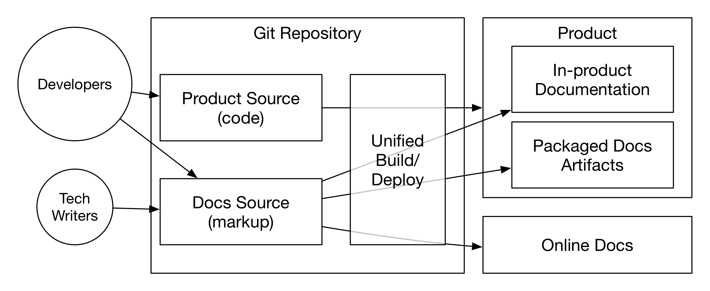

= Introduction: 'DocOps' for Forward Thinking Technical Communications

This project is my attempt to bridge a gap I straddle between the worlds of writing and software development.
I have spent my career (over two decades) in and out of media and technology, almost always mixing the two in some way, even when mixing them has not been my primary role.

What differentiates _Code Writing_ from other technical writing books is that it is solidly rooted in how today's best engineering teams operate.
The wisdom of technical writers, documentation managers, and project managers from lean/agile organizations is infused into this new approach.

DocOps parallels the field of "DevOps" (developer operations, engineers who specialize in making other engineers' work easier and more effective through tooling and automation).
DocOps means hacking platforms to enable tech writers to be better at their jobs.
To some extent this means better tooling, but it also means sensible collaboration and contribution policies, as well as a stable, predictable, and efficient workflow.

== Objectives

After reading this book and engaging its exercises, you should be better able to

* _describe software_ to users and _instruct_ them in its use;

* _support engineers_ in communicating their product to its users;

* _establish systems_ for collaborative documentation using bleeding-edge open source tools and platforms;

* _integrate documentation_ into product development… and the product itself;

* _coordinate contributions_ from agile developers in ways that complement rather than interfering with their preferred workflows;

* _convert legacy material_ to a future-compatible system; and

* _‘codify’ your technical writing_ by thinking like an engineer while sharing the product codebase.

Truth be told, I am researching and writing this book so I can be a better technical writer.
I believe the exercise of writing this book will improve my skills in all of the above categories, as well.
I hope if you follow along with my experiment, you will learn with me.
If you are moved to contribute and teach me directly, I will be grateful beyond words.

== Open Source Centricity
I love open source.
I love it in principle, and I love it in practice.
Open source software gives us collaborative power commercial software will never permit.
My pro-open-source bias will be on display throughout, so I thought I'd take a second to _prefend_ it.

[TIP]
The author makes up a lot of words.
He rarely explains them, instead expecting his audience to infer their meaning from context and root words.
Apologies are offered in advance.

Allow me to briefly overwhelm you with reasons we should all use as much open source software as possible.

Open source means access::
  When we use and support open source tools, we increase access to them for people with less means.

Open source means power::
  Inequitable distribution of power and inflexible hierarchies and workflows are hugely restricting factors.
  Fast-paced engineering teams have no room for externally imposed limitations.
  Like DevOps, DocOps needs

Open source means transparency::
  By definition, open source gives more people a view into our work.
  Transparency is good for accountability.
  Even if the audience that is getting a window into your work is relatively private (for instance, your engineering team), the point is to keep your technical writing copy in a repo others have access to. (More on this reasoning in )

Open source means speed::

Open source means security::
  I think the ancient myth that exposing your source code makes you vulnerable has been successfully debunked by now.

The most important reason you should favor and engage with open source solutions is that most of the best engineers are open source enthusiasts, if not devotees.
Not only does this suggest there is something to the phenomenon, but it means you'll need to appreciate and get comfortable with open source if you want to earn the respect of the most discerning engineers you may work with.

== Platform Thinking

Platforms mean _distributed power_, and distributed power is key to comprehensive documentation, especially in agile environments.
If you want to be successful in producing documentation for ever-changing software products, you'll need a platform solution.
This book will help you think through the various options, including hybrid platforms that will scratch various itches coherently with a little finessing up front.

== "Everything in Code"

This maxim has a dual meaning.
First, all technical writing should be written in markup.
This book also favors writing directly in markup, as opposed to using an abstraction tool backed by XML, such as Word, Google Docs, clients like oXygen, or your content management system's WYSIWYG UI.
The case for this is developed in <<writing-in-code>>.

Second, put the docs in the product codebase.
We'll discuss iteratively integrating your documentation source and platform into the repo and the product itself.
This is addressed in

.DocOps -- General Concept

== Content _Development_

You're not thinking like a developer until you look at your writing as _content development_.
There's no need to claim you write software.

== Lean Docs for Lean Projects

Documentation can be as lean and agile as any product code, even if it inherently lags behind in real time.
The truth is, unless you are somehow afforded miraculous amounts of time to document your product, it is likely that you will need to iterate from a "minimum viable product" for your user manual or other documentation.

.Scenario: Your New Startup--Day One
[[scenario-day-one]]
[.scenario]
****
include::./includes/scenario/day-one.adoc[]
****

The rest of this book will alternate between lessons revolving around the DocuMator-themed storyline for helping you develop into a full fledged DocOps-capable technical writer.
