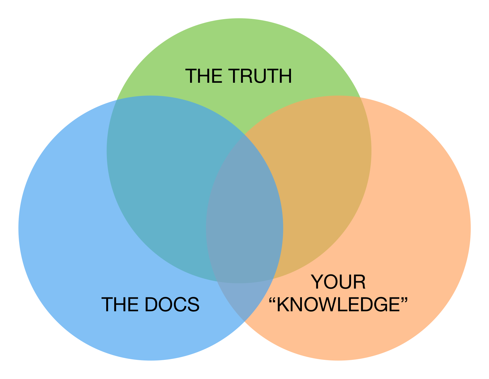
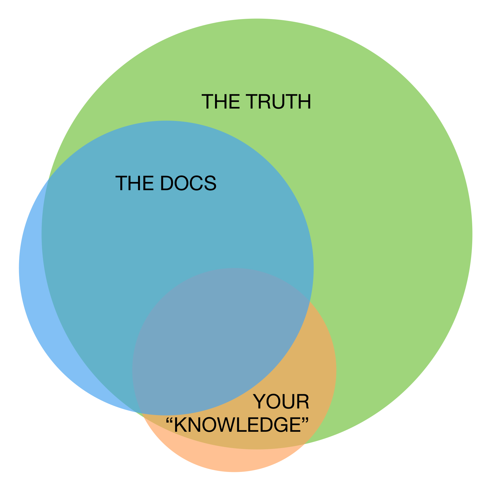

= Audience and Strategy
[abstract]
You'll never know how to reach your audience if you don't first get to know their challenges the way product developers do.

== Use the Product

This is the obvious one that everybody knows.
I have no shocking statistics on the portion of tech writers who actually use the product.

This section is not called "_master_ the product" for good reason: mastery is rarely the point.
Master users are abnormal, and unless you've been specifically tasked with appealing to outliers, you may glean little advantage from knowing how a master user engages with your product.

It also just cannot be critical that we be able to "master" the product we document.
Sure, the obvious ones are biggies like Photoshop or Drupal or Saleforce.
But it extends to consumer products as well.
I'd be willing to wager some of the video game docs I've seen were not produced exclusively by tech writers who had personally reached and killed the game's final boss.

If you're documenting a scripting language or a complex API, _fuggidaboutit_.
Virtually all modern programming languages fit the bill of _too complex to truly master_.
This is mainly because the permutations of applications and methodologies associated with a thriving language tend to grow exponentially.
Remember, mastering the language means applying it in diverse, even extraordinary circumstances.

Moreover, the risk of thinking fluently in any language is forgetting what it was like to find that language strange and off putting.
The best instructors empathize with the discomfort of an unfamiliar and possibly unintuitive system.
The people who find your product's interface intuitive may never look to your docs.
Masters and poseurs have a tendency to kick over the ladder once they're up, leaving newbies behind.
Technical writers cannot afford to leave anyone behind.

[.analogy.stretched]
.Ski School vs Ski Patrol
Your product is a mountain, your users are skiers, technical writers are the Ski School (instructors), and customer support agents are Ski Patrol (first aiders who respond to slopeside emergencies).
If your instruction takes a skier out onto the mountain, Ski Patrol is going to be mighty peeved upon finding a mangled student of yours abandoned in the trees because the rest of the class took off.

[.realtalk]
.Of Course You Should Master the Product
--
All the above bullshit aside, hell yes master the fu-fu-f-f-foundation right out from under that product.
Live, breathe, and love the product.

I actually believe many documentation projects would suffer a net loss overall in terms of quality if the were only documented by masters of that product.
I have also followed along with a 500-page unofficial user guide written by a master of a product and been bowled over by the sheer relevance and accuracy of it.

The latter goal may result from leaving a paid gig.
Unless you make a consumer product, it is probable that you will need to work in the field in order to master your own software.
Effort is required to learn a complex _application_ (software that does something useful) well enough to get paid to write an unofficial guide or consult with business users.

The insights you'll be able to take with you after watching the product's core engineers work could continue paying dividends for years to come.
--

== Use the Docs

One of the biggest mistakes a tech writer can make is to confuse oneself with the Reference Manual one maintains.
What its author _knows_ and what a doc actually expresses are two decidedly distinct things.

Throw in that pesky truth factor, and you get the makings for a graphical chuckle that will earn you nearly ten emoticon clicks when you post it to Slack.

.Venn Diagram of Knowledge–Docs–Truth Trinity

That's _funny haha_, but the reality feels a little less comfortable, if a bit more familiar.

.Venn Diagram of Real KDT Trinity

The proportions may vary depending on all the obvious variables.
The question is, do you know the shape of your Venn diagram?

I did not title this section "_read_ the docs".
Reading is implied in _use_, which also demands a connection between the docs and the product.

I also carefully chose "use _the_ docs" instead of "use _your_ docs".
If you are not the only tech writer, you should be the first reader of other writers' work as often as possible.
This is true between products.

== Learn Your Users' Motivation

It is very often not remotely possible for a tech writer or docs manager to master the product they're responsible for documenting.
Take a case like mine, IT operations monitoring and analytic software.
I happen to have some background in system and network administration, but I don't think I was ever responsible for a cluster of 10 or more servers.

Our users are responsible for the smooth operation of tens of thousands of servers and networking devices at any given moment, collectively logging millions of significant computational events per second.

== Use Competitors' Products

I used to think only product designers and Sales and Marketing needed to be familiar with the competition.
Then I figured out all our customers were expecting our product to work like our dominant competitor's offering.
Apparently, the only things keeping some customer prospects from running fast and far from our demo is the intuitiveness of the GUI and the relatability of the docs.
The good news is that I can actually explore the world they think they're getting when they first crack open our product.
So informed, the theory is I can better ease the user's transition from expectation to satisfaction, all without so much as passing through the panic stage (at least so long as they open the docs on time).

By using competitors' products, you will learn about your own users.
Now you are visualizing your users' expectations.

Does your product do something you call _parsing_, which your chief competitor has called _processing_ for 10 years?
You may have good reason for it; users probably don't care.
What they may need is to see the word _processing_ somewhere in the sentence that introduces your _parsing_ functionality.

Does your product call for *File menu:[>] Export* for an operation some competitors use *File menu:[>] Save* to perform?
Again, you can be as agnostic about which is better as I am not knowing what your product even does, or you can be downright opposed to abusing "Export" the way you feel your engineers have.
All that matters for your docs is that you intervene gracefully where you expect new users might reflexively look, pointing them to the new home of the functionality they desire.

== Lean Documentation

== Test and Test Again

=== Testing Systematically

== Assess Traction

== Output Implications

== Value Add
